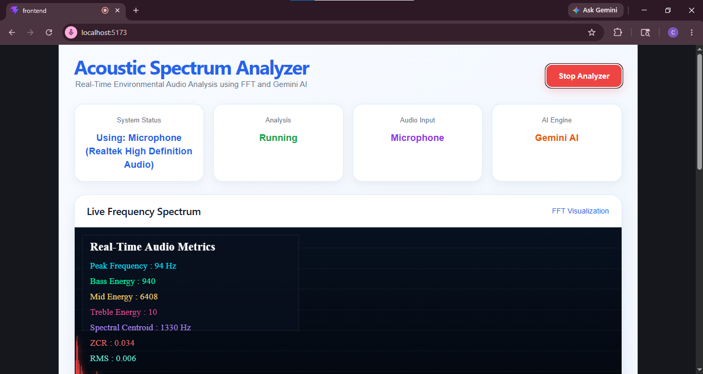

# AI-Acoustic-Spectrum

AI-Acoustic-Spectrum is a realtime web-based acoustic analysis system that combines Digital Signal Processing (DSP) with AI-assisted interpretation. The project captures live microphone audio, performs FFT-based spectral analysis, extracts acoustic features, and generates human-readable observations using the Gemini API.

The system was developed as an academic and research-oriented project focused on realtime audio visualization, acoustic feature extraction, backend streaming, and AI-integrated analysis.

---

# Project Overview

The application performs realtime acoustic analysis directly in the browser using the Web Audio API. Audio features are processed and streamed to a Django backend through WebSockets, where additional processing and AI interpretation are performed.

The system includes:

- Realtime FFT spectrum visualization
- Waveform visualization
- Peak frequency detection
- RMS energy analysis
- Frequency-band energy estimation
- Realtime backend communication
- Gemini AI-based acoustic interpretation
- Responsive dashboard interface

---

# Preview

## Dashboard Interface

Replace the image below with your main UI screenshot.





---

## System Architecture

Replace the image below with your architecture or workflow diagram.


---

# Technology Stack

## Frontend

- React.js
- JavaScript
- Web Audio API
- HTML/CSS

## Backend

- Django
- Django Channels
- Redis
- Celery
- WebSockets

## AI Integration

- Google Gemini API

---

# Project Structure

```bash
AI-Acoustic-Spectrum/
│
├── frontend/
│   ├── src/
│   │   ├── App.jsx
│   │   ├── main.jsx
│   │   └── components/
│   │
│   └── package.json
│
├── backend/
│   ├── acoustic_backend/
│   ├── analyzer/
│   │   ├── consumers.py
│   │   ├── routing.py
│   │   ├── tasks.py
│   │   └── gemini_service.py
│   │
│   ├── manage.py
│   └── requirements.txt
│
└── README.md
```

---

# Core Functionalities

## Realtime Audio Capture

The application captures live microphone input directly from the browser using the Web Audio API.

## FFT Spectrum Analysis

Realtime Fast Fourier Transform (FFT) analysis is used to visualize frequency-domain acoustic information.

## Acoustic Feature Extraction

The system extracts important DSP features including:

- Peak Frequency
- RMS Energy
- Bass Energy
- Mid-range Energy
- Treble Energy

## Realtime Communication

Audio features are streamed between frontend and backend using WebSockets with Django Channels.

## AI Interpretation

Extracted acoustic features are interpreted using the Gemini API to generate readable observations about the acoustic environment.

---

# Gemini API Configuration

## Step 1 — Generate API Key

Create a Gemini API key from:

https://ai.google.dev/

---

## Step 2 — Install Gemini Package

Inside the backend environment:

```bash
pip install google-generativeai
```

---

## Step 3 — Configure API Key

Open:

```bash
backend/analyzer/gemini_service.py
```

Add your API key:

```python
import google.generativeai as genai

genai.configure(
    api_key="YOUR_GEMINI_API_KEY"
)
```

---

# Local Installation and Setup

## 1. Clone Repository

```bash
git clone https://github.com/your-username/AI-Acoustic-Spectrum.git
```

```bash
cd AI-Acoustic-Spectrum
```

---

# Frontend Setup

Open a terminal inside the frontend directory:

```bash
cd frontend
```

Install dependencies:

```bash
npm install
```

Run the frontend:

```bash
npm run dev
```

Frontend server:

```bash
http://localhost:5173
```

---

# Backend Setup

Open another terminal inside the backend directory:

```bash
cd backend
```

Create virtual environment:

```bash
python -m venv venv
```

Activate virtual environment:

## Windows

```bash
venv\Scripts\activate
```

## Linux / macOS

```bash
source venv/bin/activate
```

Install dependencies:

```bash
pip install -r requirements.txt
```

---

# Redis Setup

Run Redis using Docker:

```bash
docker run -p 6379:6379 redis
```

---

# Run Django Backend

```bash
python manage.py runserver
```

Backend server:

```bash
http://127.0.0.1:8000
```

---

# Run Celery Worker

Open another backend terminal:

```bash
celery -A acoustic_backend worker -l info
```

---

# WebSocket Endpoint

```bash
ws://127.0.0.1:8000/ws/audio/
```

---

# Performance and Features

The system supports:

- Realtime FFT rendering
- Live waveform visualization
- Dynamic acoustic metric updates
- AI-generated acoustic observations
- Responsive dashboard rendering
- Realtime frontend-backend streaming

---

# Current Limitations

- The system currently uses a standard laptop microphone without professional calibration.
- Small environmental sounds may not always be classified accurately.
- Gemini responses are interpretive and not measurement-certified.
- Acoustic accuracy depends on microphone quality and surrounding conditions.

---

# Future Improvements

Possible future extensions include:

- RT60 reverberation analysis
- Advanced sound classification
- Multi-channel audio input
- Improved DSP feature extraction
- Cloud deployment support
- ML-based environmental sound recognition

---

# References

- Web Audio API  
  https://developer.mozilla.org/en-US/docs/Web/API/Web_Audio_API

- Django Documentation  
  https://docs.djangoproject.com/

- Django Channels  
  https://channels.readthedocs.io/

- Redis Documentation  
  https://redis.io/documentation

- React Documentation  
  https://react.dev/

- Google Gemini API  
  https://ai.google.dev/

---

# Author

This project was developed as an individual academic and research-oriented project focused on realtime acoustic signal analysis and AI-assisted interpretation.
